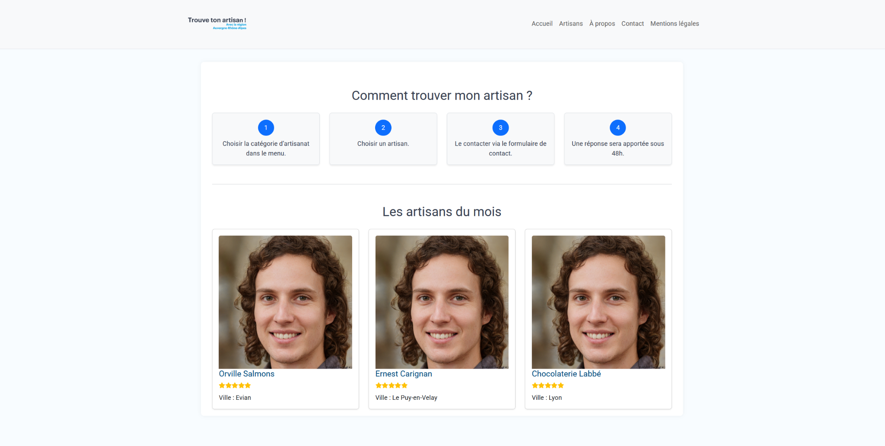
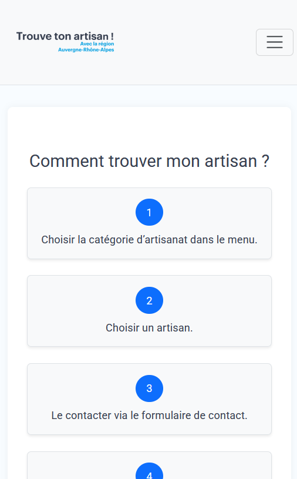
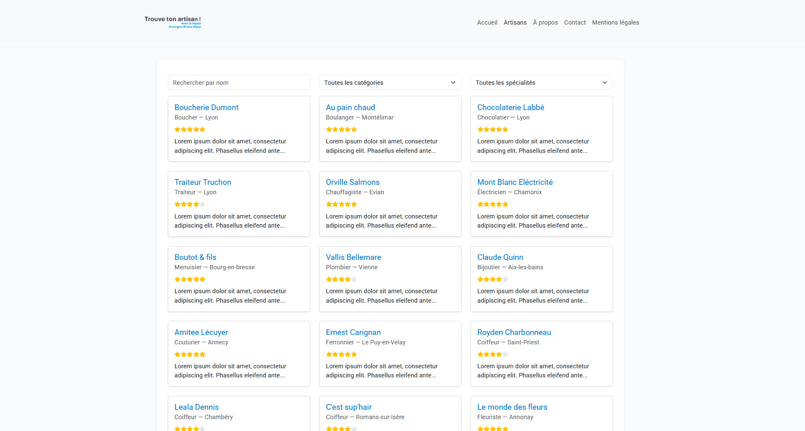
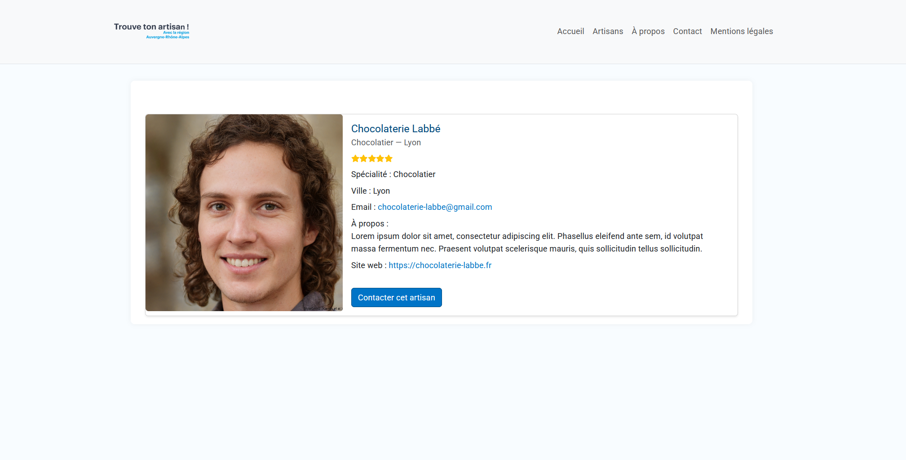
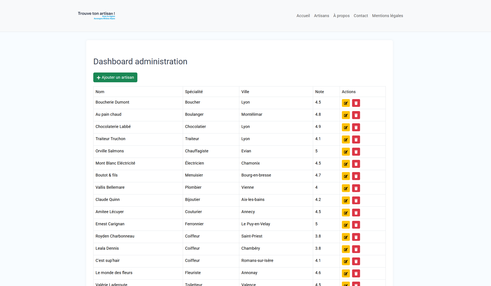

# Trouve ton Artisan 🛠️


## 📁 Structure du projet

```
trouve-ton-artisan/
├── backend/               # API Express (Node.js + Sequelize)
├── frontend/              # Frontend React (Vite + Bootstrap)
├── sql/                   # Scripts SQL
│   ├── insert.sql         # Données d'exemple à insérer
│   └── schema.sql         # Schéma de la base de données
├── .gitignore
├── .gitattributes
```
## Présentation du site

Le site **Trouve ton artisan** permet de rechercher un artisan par spécialité ou catégorie, puis de le contacter via un formulaire. Il est responsive, rapide, et dispose d'un panneau d'administration fonctionnel.

---

### 🏠 Page d'accueil (desktop)

> Affiche les meilleurs artisans du mois, avec une interface claire.

<div align="center">
  
</div>

---

### 📱 Page d'accueil (mobile)

> Site totalement responsive, adapté aux smartphones.

<div align="center">
  
</div>

---

### 📋 Listing des artisans

> Un moteur de recherche combiné à des filtres dynamiques (catégorie et spécialité).

<div align="center">
  
</div>

---

### 🧑‍🔧 Fiche artisan

> Détail complet de chaque artisan accessible depuis `/artisans/:id`.

<div align="center">
  
</div>

---

### ⚙️ Dashboard Admin

> Tableau de bord disponible à `/admin` pour ajouter, modifier ou supprimer un artisan.

<div align="center">
  
</div>


## ⚙️ Backend

Le backend repose sur :
- **Node.js + Express**
- **Sequelize** pour l'ORM
- **MySQL** comme base de données

Routes principales :
- `GET /api/artisans` : liste des artisans
- `GET /api/artisan/:id` : détail d’un artisan
- `GET /api/categories` : liste des catégories
- `GET /api/specialites` : liste des spécialités

La configuration de la BDD est dans `.env`. Exemple :
```
DB_HOST=localhost
DB_NAME=trouve
DB_USER=root
DB_PASSWORD=Admin
FRONT_URL=http://localhost:5173
```

Lancement :
```bash
cd backend
npm install
npm run dev
```

## 💻 Frontend

Réalisé en :
- **React.js**
- **Vite**
- **React Router**
- **Bootstrap 5**

Pages disponibles :
- Accueil
- Liste des artisans (filtrable)
- Fiche artisan
- Contact (Formspree)
- Mentions légales, Accessibilité, Cookies (en construction)
- Dashboard admin

Lancement :
```bash
cd frontend
npm install
npm run dev
```

## 🛢️ Base de données

- Le fichier `schema.sql` contient la création des tables.
- Le fichier `insert.sql` contient les jeux de données.

Import recommandé :
```bash
mysql -u root -p trouve < sql/schema.sql
mysql -u root -p trouve < sql/insert.sql
```

## ✅ Fonctionnalités clés

- 🎨 Interface utilisateur fluide et responsive
- 📚 Routing frontend (React Router)
- 🔒 Sécurité minimale avec Helmet & CORS
- 🔍 Filtres dynamiques
- 📬 Formulaire de contact (Formspree)
- 🗃️ Architecture claire et modulaire
